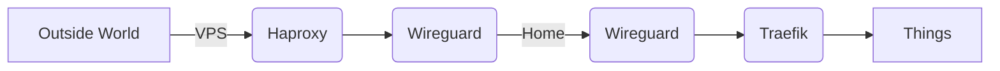

# Homelab

This repo records all my docker files and sample configs for my home lab setup.

I plan to use ansible in the future and learn K8s, until then, we roll `docker compose`

## Setup

All outside traffic is proxied via my vps. VPS connects to my home lab via a wireguard tunnel. This allows me to not open any ports at home.

