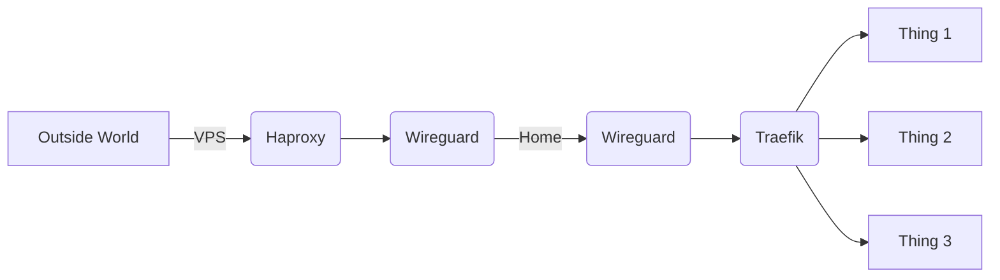

# Homelab

This repo records all my docker files and sample configs for my home lab setup.

I plan to use ansible in the future and learn K8s, until then, we roll `docker compose`


## Setup

All outside traffic is proxied via my vps. VPS connects to my home lab via a wireguard tunnel. This allows me to not open any ports at home.



### Encryption and Obfuscation

You may have noticed all my config files and .envs are in this repo. I utilize [sops](https://github.com/getsops/sops) with [age](https://github.com/FiloSottile/age) to encrypt them.

Domain I use to host my stuff on is also obfuscated in compose files as well.

`.gitattributes` has the rules on how encryption, decryption and domain obfuscation works

### .gitattributes

Append this at the end of .git/config with DOMAINHERE being your domain to replace, for stuff.
You can run this from root directory

```bash
tee -a .git/config << EOF
[filter "obfuscate-domain"]
    smudge = sed s/domain.com/YOUR_DOMAIN/g %f
    clean = sed s/YOUR_DOMAIN/domain.com/g %f
    required

[filter "encrypt-decrypt"]
    smudge = sops decrypt %f
    clean = sops encrypt %f
    required

EOF
```
